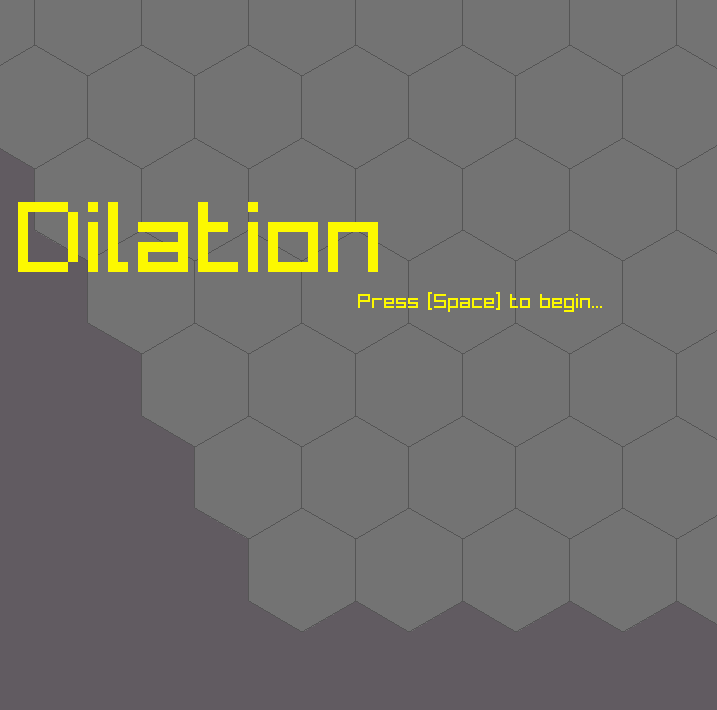
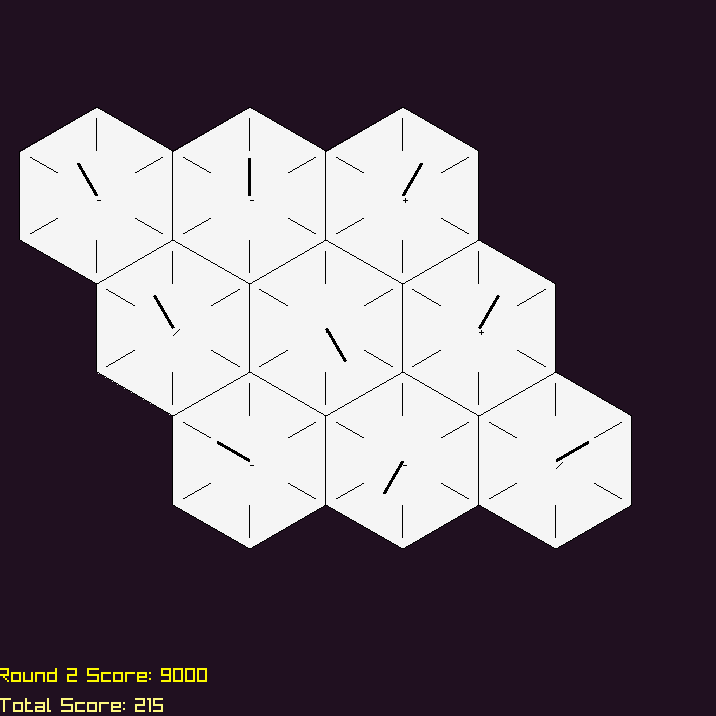

# Dilation 

## The game where *time is of the essence*.

### Description

Dilation is a puzzle game where *time is of the essence.* Player must merge
hexagonal clocks together when they read the same time, 
but the clocks themselves tick at different rates. 
Merging clocks changes their tick rate. 

### Features

 - Puzzlement
 - Strategy
 - Hex Merging
 - Bass Riffs

### Controls

Mouse:
- select and merge

Spacebar:
- start next level

### Developers

 - Dan Simonson: code, art, bass riffs

### Links

 - itch.io Release: https://domentsyn.itch.io/dilation

### License

This project sources are licensed under an unmodified zlib/libpng license, which is an OSI-certified, BSD-like license that allows static linking with closed source software. Check [LICENSE](LICENSE) for further details.

*Copyright (c) 2026 Dan Simonson (@thedansimonson)*
